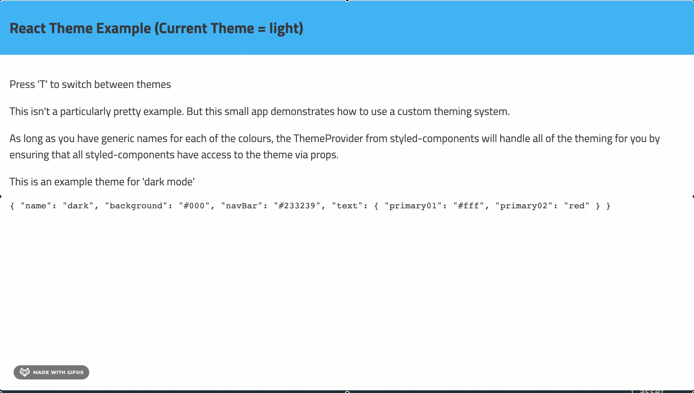

# React Theming Example

This is a showcase of using [Styled Components](https://styled-components.com/docs) to support multiple themes in a React app.

The project has 3 themes - light, dark and retro.



**Some of the benefits of styled components include:**

- Encourages modular components with self contained JSX and styles
- Makes it easy to use props to change styles
- ThemeProvider makes it easy to support multiple themes very easily

**What if I'm not using React or want to use styled components?**

- If you don't care about IE11 or Edge. CSS variables can accomplish the same thing. Create a json file for each theme and iterate through each colour and create css variables using javascript.

## How to run

```
npm install
npm run serve
```
